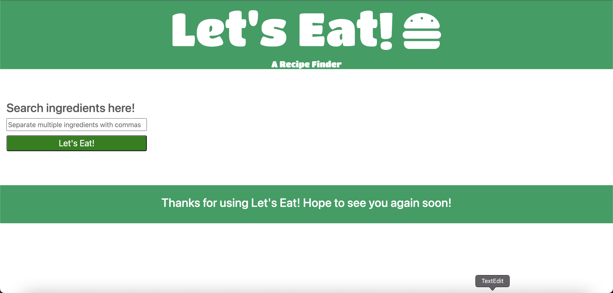
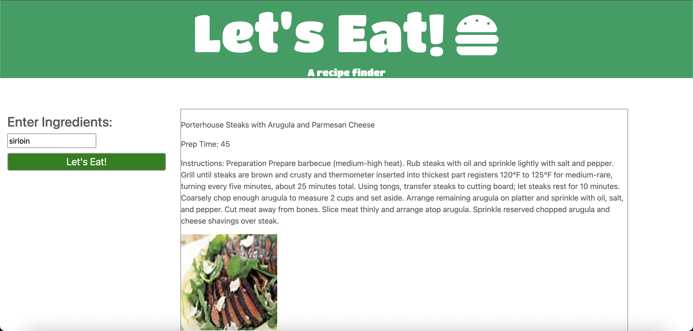
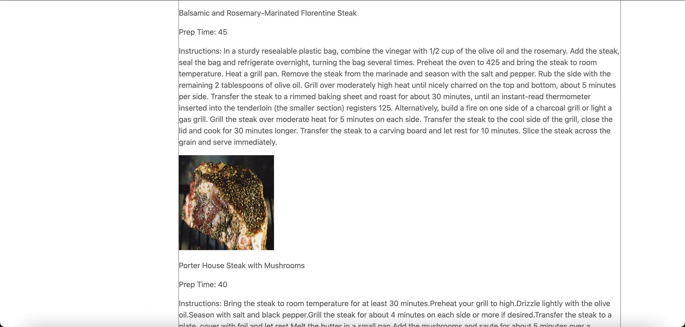

# Lets-Eat
Project #1 for GT Coding Bootcamp 2022

PROJECT TEAM MEMBERS
---
Jesus Islas

Ranjani Siva

Oluwaseyi M Oshinowo

Aldo Pelayo

Adam Martin

PROJECT DESCRIPTION
---
The user will search an ingredient in a text field. The application will then return 6 results with the following information:

Dish title

Dish prep time

Dish instructions

Image of dish

USER STORY
---
AS A hungry user
I WANT to get recipe suggestions based on a chosen ingredient
SO THAT I have ideas of what I can make, how long it will take to prepare, how to make it, and what it looks like

APIs IN THIS APPLICATION
---
Spoontacular recipe API

PICTURES OF APPLICATION
---

